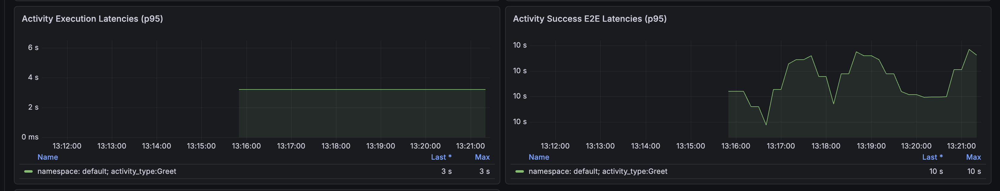
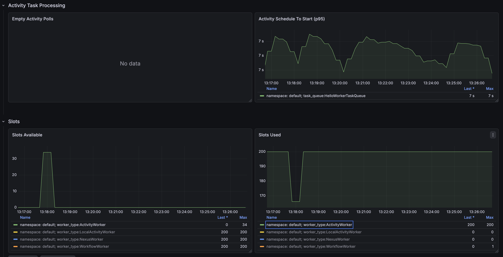
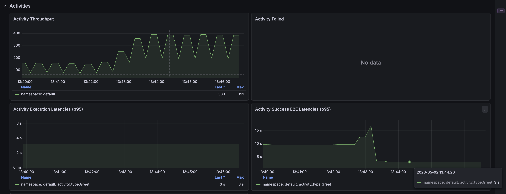
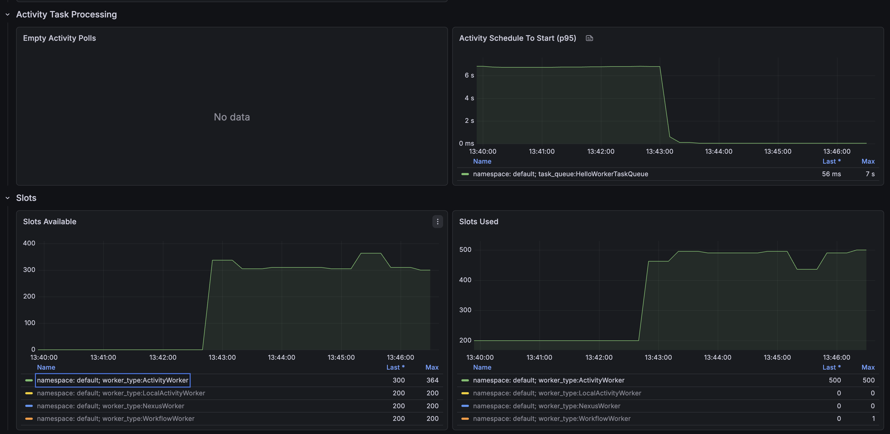

# Worker Tuning

Temporal Workers poll for tasks and execute them
concurrently up to a configurable limit. When
that limit is reached, tasks remain scheduled on
the server until a slot frees up — a delay
captured by the
`activity_schedule_to_start_latency` metric.

In this demo we will run a workload that
deliberately saturates the default activity
executor pool, identify the bottleneck on a
Grafana dashboard, and tune
`max-concurrent-activity-executors` to bring
latency back down.

## Objective

- Run a workload that saturates the default
  activity executor pool (200 slots)
- Identify the bottleneck using
  `activity_schedule_to_start_latency` and the
  activity slot panels in Grafana
- Tune `max-concurrent-activity-executors` to
  free up slots and restore throughput
- Understand the trade-offs of increasing worker
  concurrency

## Prerequisites

- Java 21
- Docker (for the metrics stack)
- [Temporal CLI](https://docs.temporal.io/cli)
- Familiarity with Temporal workflows and
  activities
- Familiarity with Spring Boot basics

Start a local Temporal dev server:

```bash
task temporal:start
```

Or, without [Task](https://taskfile.dev):

```bash
temporal server start-dev
```

The server listens on `127.0.0.1:7233` with the
Web UI at `http://localhost:8080`.

## Key Concepts

### Activity task slots

`max-concurrent-activity-executors` controls how
many Activity Tasks a single Worker runs at the
same time. When all slots are occupied, newly
scheduled tasks wait on the Temporal server until
a slot frees up. The wait time is recorded by
`temporal_activity_schedule_to_start_latency`.

### Poller autoscaling

Pollers fetch tasks from the Temporal server. In
this demo both workflow and activity task
pollers use `poller-behavior-autoscaling`, so
their count adjusts automatically.

## Steps

### Step 1 — Explore the project

Open `demo/`. The package
`io.temporal.workshops.springboot.workertuning`
contains:

- **`Application`** — Spring Boot entry point
- **`StarterRunner`** — starts 100 workflows
  (active on the `starter` profile)
- **`HelloWorkflow`** / **`HelloWorkflowImpl`** —
  executes 5 activities concurrently per loop
  iteration; continues-as-new when suggested
- **`HelloActivity`** / **`HelloActivityImpl`** —
  simulates ~3 seconds of work (random sleep
  between 3 000 and 3 100 ms)

Open
[`application.yaml`](demo/src/main/resources/application.yaml).
The key settings for the `HelloWorkerTaskQueue`
worker are:

```yaml
capacity:
  max-concurrent-workflow-task-executors: 200
  max-concurrent-activity-executors: 200   # tuning target
```

Both poller sets use autoscaling, so their count
adjusts automatically:

```yaml
activity-task-pollers:
  poller-behavior-autoscaling:
    minimum-slots: 1
    maximum-slots: 200
    initial-slots: 5
```

### Step 2 — Run the application

Start the metrics stack:

```bash
cd metrics-stack
docker compose down
docker compose up
```
This will start
- Prometheus: http://localhost:9090/query
- Grafana: http://localhost:3000/ 
- A collector for Temporal SDK metrics


In a separate terminal, start the worker:

```bash
cd demo
./mvnw spring-boot:run
```

In another terminal, start the workflows:

```bash
cd demo
./mvnw spring-boot:run -Dspring-boot.run.profiles=starter
```

The starter creates 100 long-running workflows.
Each workflow schedules 5 activities concurrently
per loop iteration and eventually continues-as-new.
With 200 activity slots and 100 workflows each
scheduling 5 concurrent activities, the slot pool
fills up quickly.

While the starter runs, open the 
[Temporal Web UI](http://localhost:8080/namespaces/default/workflows)
to check the workflows

### Step 3 — Observe the metrics

After a few minutes (2-5 minutes), open the Grafana dashboard:

`http://localhost:3000` → Dashboards →
[[DEMO] Temporal Java SDK (OTel) Metrics](http://localhost:3000/d/demo-temporal-java-sdk-otel-metrics/demo-temporal-java-sdk-otel-metrics)

> The dashboard is scoped to the panels relevant
> to this demo; some panels are collapsed.
> A full reference is in the
> [dashboard repository](https://github.com/temporalio/dashboards).

#### activity_schedule_to_start_latency

After confirming there are no RPS errors, scroll
to the latency panel. You should notice that
activity execution latency is around 3 seconds
(see
[`HelloActivityImpl.java`](demo/src/main/java/io/temporal/workshops/springboot/workertuning/worker/HelloActivityImpl.java))
while activity e2e latency is around 10 seconds.



The gap between execution and e2e latency
typically has one of the following causes:

- **Server throttling** — the Temporal server
  returns `RESOURCE_EXHAUSTED` gRPC errors, 
  causing pollers to back off and
  slowing task dispatch
- **Activity retries** — failed activities are
  rescheduled, adding `schedule_to_start` time on
  each attempt; in production check
  [`temporal_cloud_v1_activity_task_fail_count`](https://docs.temporal.io/cloud/metrics/openmetrics/metrics-reference#temporal_cloud_v1_activity_task_fail_count)
- **Slot saturation** — all worker executor slots
  are occupied. In this demo pollers are
  configured with autoscaling, so starvation is
  unlikely; if slot saturation is ruled out,
  poller starvation is the next thing to check.

Scroll to the activity slot panels. You should
see that all 200 activity task slots are occupied
and zero slots are available — this confirms that
`schedule_to_start_latency` is caused by slot
saturation.

> The worker has 200 activity task slots. With
> 100 workflows each scheduling 5 concurrent
> activities, demand reaches 500 slots.



### Step 4 — Tune the activity executor pool

> In a production environment, always check
> worker CPU and memory utilization before
> increasing concurrency. A larger slot pool can
> also overload downstream services.

Open
[`application.yaml`](exercise/src/main/resources/application.yaml)
and increase `max-concurrent-activity-executors`
to `800`:

```yaml
capacity:
  max-concurrent-activity-executors: 800
```

Stop the worker and restart it:

```bash
cd demo
./mvnw spring-boot:run
```

After a couple of minutes, return to the Grafana
dashboard. You should observe that:

- Activity execution latency and e2e latency now
  match
- Activity throughput has increased significantly



Scroll to the slot panels. Activity task slots
are now available and `schedule_to_start_latency`
is in the order of 50 ms.



## Key Takeaways

1. **`max-concurrent-activity-executors`** caps
   how many Activities a Worker runs at once.
   When all slots are taken, new tasks queue on
   the server.
2. **`schedule_to_start_latency`** is the clearest
   signal of slot saturation. A growing gap
   between execution latency and e2e latency
   points directly to this metric.
3. **Tuning is iterative**: increase the slot
   count in small increments, redeploy, and
   observe CPU, memory, and downstream load
   before the next change.
4. **Downstream impact**: a larger slot pool
   processes tasks faster but can overload
   databases or external APIs further down the
   call chain.

## Resources

- [Performance bottlenecks troubleshooting guide](https://docs.temporal.io/troubleshooting/performance-bottlenecks#temporal_activity_schedule_to_start_latency-spike)
- [Worker performance — Temporal Docs](https://docs.temporal.io/develop/worker-performance)
- [Spring Boot integration — Java SDK](https://docs.temporal.io/develop/java/spring-boot-integration)
- [Temporal dashboards repository](https://github.com/temporalio/dashboards)